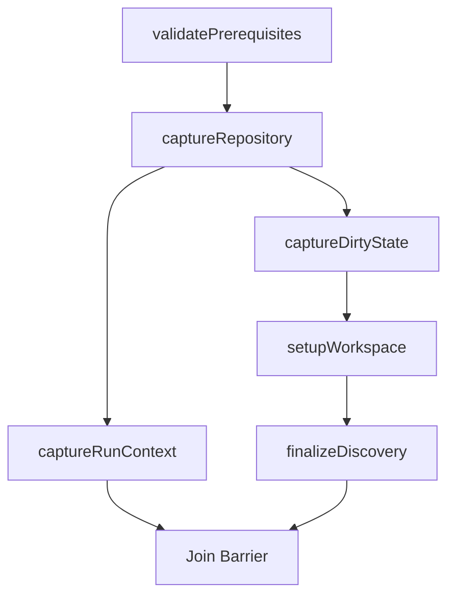

# NIB-M — `/go` Run Init Pipeline Orchestration

VegaCorp — July 2026

---

## 1. Purpose

This module specifies the asynchronous execution graph and orchestration logic for the 6 bootstrap tasks of the `/go` startup phase. It manages concurrency, shared cancellation contexts via `AbortController`, parallel task forks, join barriers, and the projection of outputs into Turnlock's `WorkflowState`.

---

## 2. Inputs

```ts
type RunInitPipelineInput = {
  runDir: string;
  bootstrapState: {
    runId: string;
    artefactRoot: string;
    workspaceRoot: string;
    policy: WorkflowPolicy;
    captureContext: CaptureContext;
    invocationDirectory: string;
  };
  clock: { nowWallIso: () => string };
};
```

- **Dependency Tasks NIB-Ms**:
  - [NIB-M-GO-PREREQUISITE-VALIDATION.md](./NIB-M-GO-PREREQUISITE-VALIDATION.md)
  - [NIB-M-GO-REPO-CAPTURE.md](./NIB-M-GO-REPO-CAPTURE.md)
  - [NIB-M-GO-RUN-CAPTURE.md](./NIB-M-GO-RUN-CAPTURE.md)
  - [NIB-M-GO-DIRTY-STATE-CAPTURE.md](./NIB-M-GO-DIRTY-STATE-CAPTURE.md)
  - [NIB-M-GO-WORKSPACE-SETUP-CONTRACT.md](./NIB-M-GO-WORKSPACE-SETUP-CONTRACT.md)
  - [NIB-M-GO-PROJECT-DISCOVERY-FINALIZE.md](./NIB-M-GO-PROJECT-DISCOVERY-FINALIZE.md)

---

## 3. Outputs

- Updates the global `WorkflowState` object by projecting the resolved artifacts:
  - `state.runCapture = RunCaptureArtifact`
  - `state.workSession = WorkSession`
  - `state.projectDiscovery = ProjectDiscovery`
  - `state.runInit = RunInitRecord`
- Returns a Promise resolving to `true` on successful initialization.

---

## 4. Algorithm

### 4.1 Asynchronous Execution Graph
The pipeline executes tasks according to the following dependency graph to ensure `workspace-setup` does not wait on `run-capture`:



1. **Step 1**: Run `validatePrerequisites` sequentially.
2. **Step 2**: Run `captureRepository` sequentially (consumes output from Step 1).
3. **Step 3 (Parallel Fork)**:
   - **Branch A**: Run `captureRunContext`.
   - **Branch B**: Run `captureDirtyState` (consumes output from Step 2), then `setupWorkspace` (consumes output from `captureDirtyState` and `captureRepository`), then `finalizeDiscovery` (consumes output from `setupWorkspace`).
4. **Step 4 (Join Barrier)**: Execute both branches concurrently using `Promise.allSettled` to guarantee all tasks terminate cleanly before state evaluation.

### 4.2 Cancellation and Error Propagation
1. Create a shared `AbortController` instance at pipeline initialization.
2. Pass the controller's `Signal` to all 6 bootstrap task instances.
3. **Abort on Reject**: Wrap each task in a validation wrapper. If any task rejects, invoke `controller.abort()` immediately to signal cancellation to all concurrent branches.
4. **AllSettled Resolution**: Wait for `Promise.allSettled` of both branches to complete. If any branch has a rejected status, throw the first rejection error (or cancellation trace) to Turnlock FSM to fail the run init phase, ensuring no partial or corrupted states are adopted.

### 4.3 Join Validation and State Projection
Before committing changes to the FSM:
1. Verify that all tasks returned successfully, and their respective JSON files exist in `artefactRoot`.
2. **BootstrapFindings Gate (Phase 1)**:
   - Read the file `<artefactRoot>/startup/project-discovery-finalize/bootstrap-findings.json`.
   - Validate its content against the `BootstrapFindings` schema.
   - If any finding inside the parsed array contains a severity of `"blocking"`:
     - Throw a `PhaseError` immediately (fail-closed). This aborts execution before emitting the implementation delegation to the agent.
     - *Note*: in Phase 2+, this throw will be replaced by a Turnlock `HumanGate` suspension trigger when the runtime supports it, letting users check the warning, resolve the issue, and resume execution.
3. Initialize the following nine `WorkflowState` fields to empty `[]` (Phase 1 empty-collection invariant per NIB-S §3):
   - `state.snapshots = []`
   - `state.checks = []`
   - `state.findings = []`
   - `state.humanGates = []`
   - `state.remediations = []`
   - `state.branches = []`
   - `state.commits = []`
   - `state.pullRequests = []`
   - `state.mergeTracking = []`
4. Construct the `RunInitRecord` artifact:
   - `schema`: `"go.run-init.v1"`
   - `runId`: From inputs.
   - `repoCapture`: The resolved `RepoCapture` artifact.
   - `repoCaptureHash`: The JCS hash of `RepoCapture`.
   - `workflowPolicyHash`: The JCS hash of `policy.dirtyState`.
   - `captureContextHash`: The JCS hash of `captureContext` (or sentinel hash if not applicable).
   - `turnlockRun`: Reference to the active Turnlock run object.
   - `artefactRootRef`: Path to `artefactRoot`.
   - `workspaceRootReservedPath`: Path to `workspaceRoot`.
   - `ownershipMarkerRef`: Path to the `run-init-ownership.json` file.
   - `initializedAt`: Timestamp retrieved using `clock.nowWallIso()`.
   - `dirtyStateDiff`: The resolved `DirtyStateDiffArtifact` (optional, if dirty).
5. Map the task outputs into the Turnlock runtime state:
   - `state.runCapture = runCaptureResult`
   - `state.workSession = workSessionResult`
   - `state.projectDiscovery = discoveryResult`
   - `state.runInit = runInitRecord`
6. Transition Turnlock to the `implementation` delegation phase.

---

## 5. Example

### 5.1 Pipeline Execution Handler
```ts
import { validatePrerequisites } from "./prerequisites.js";
import { captureRepository } from "./repo-capture.js";
import { captureRunContext } from "./run-capture.js";
import { captureDirtyState } from "./dirty-state.js";
import { setupWorkspace } from "./workspace.js";
import { finalizeDiscovery } from "./discovery.js";

export async function executeBootstrapPipeline(input) {
  const { bootstrapState, runDir, clock } = input;
  const { runId, artefactRoot, workspaceRoot, policy, captureContext, invocationDirectory } = bootstrapState;
  
  const controller = new AbortController();
  const signal = controller.signal;

  const abortOnReject = async (promise) => {
    try {
      return await promise;
    } catch (err) {
      controller.abort();
      throw err;
    }
  };

  try {
    // 0. Ensure target folders are initialized
    fs.mkdirSync(artefactRoot, { recursive: true });

    // 1. Prerequisites validation
    const prereq = await abortOnReject(validatePrerequisites({ runId, artefactRoot, clock, signal }));

    // 2. Repo Capture
    const repo = await abortOnReject(captureRepository({ invocationDirectory, runDir, artefactRoot, clock, signal }));

    // Parallel Branch A: Run Capture
    const branchA = abortOnReject(captureRunContext({ runId, artefactRoot, captureContext, clock, signal }));

    // Parallel Branch B: Git Chain
    const branchB = abortOnReject((async () => {
      const dirty = await captureDirtyState({ runId, artefactRoot, repoCapture: repo, policy, clock, signal });
      const workSession = await setupWorkspace({ runId, runDir, repoCapture: repo, dirtyStateDiff: dirty, policy, artefactRoot, workspaceRoot, clock, signal });
      const discovery = await finalizeDiscovery({ runId, workSession, repoCapture: repo, workspaceRoot, artefactRoot, policy, clock, signal });
      return { dirty, workSession, discovery };
    })());

    // Join Barrier via allSettled
    const results = await Promise.allSettled([branchA, branchB]);

    const failures = results.filter(r => r.status === "rejected");
    if (failures.length > 0) {
      throw (failures[0] as PromiseRejectedResult).reason;
    }

    const runCapture = (results[0] as PromiseFulfilledResult<any>).value;
    const gitChain = (results[1] as PromiseFulfilledResult<any>).value;

    return {
      prereq,
      repo,
      runCapture,
      dirtyState: gitChain.dirty,
      workSession: gitChain.workSession,
      discovery: gitChain.discovery
    };
  } catch (error) {
    controller.abort();
    throw error;
  }
}
```

---

## 6. Edge cases

- **Early failure**: If `validatePrerequisites` fails, the execution graph aborts immediately without launching any background capture tasks.

---

## 7. Constraints

- **Single Signal**: All child execution steps must bind to the same shared `AbortSignal` context.

---

## 8. Integration

Invoked within Turnlock's initial phase execution hook:

```ts
import { executeBootstrapPipeline } from "./pipeline.js";
```

---

*VegaCorp — Implicit-Free Execution (IFE) — "Reliability precedes intelligence."*
